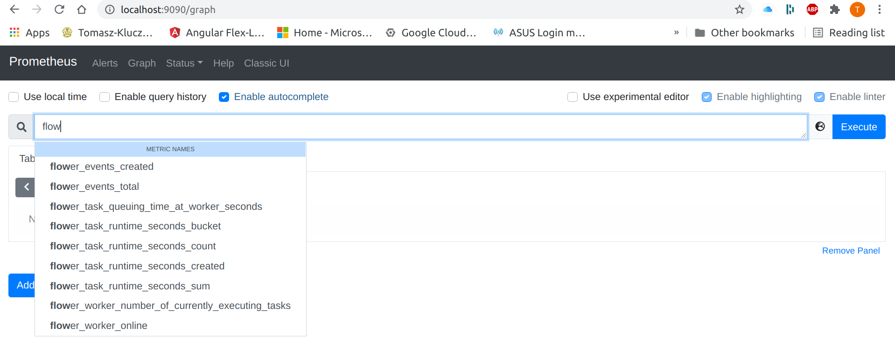
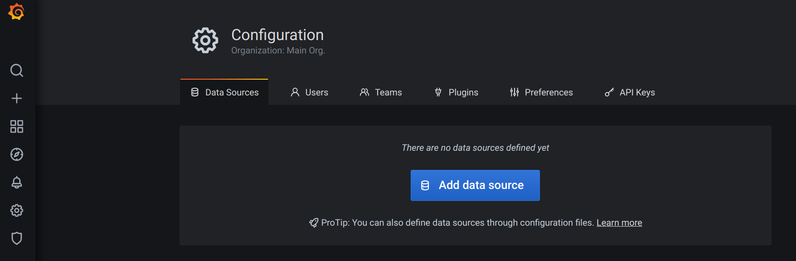
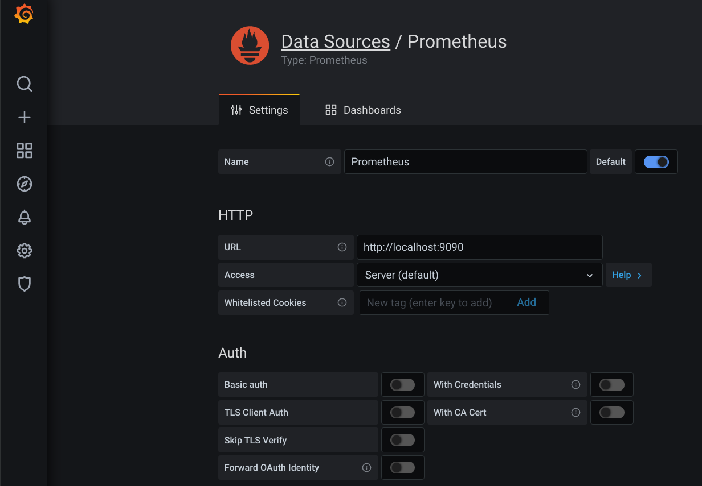
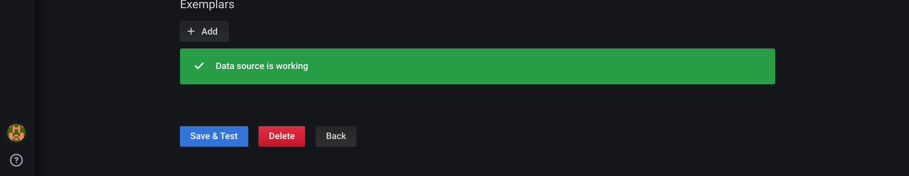
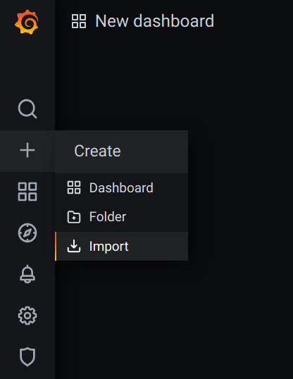
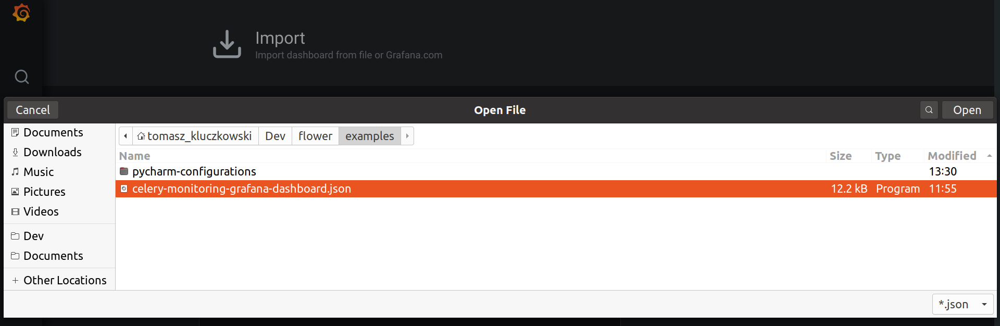
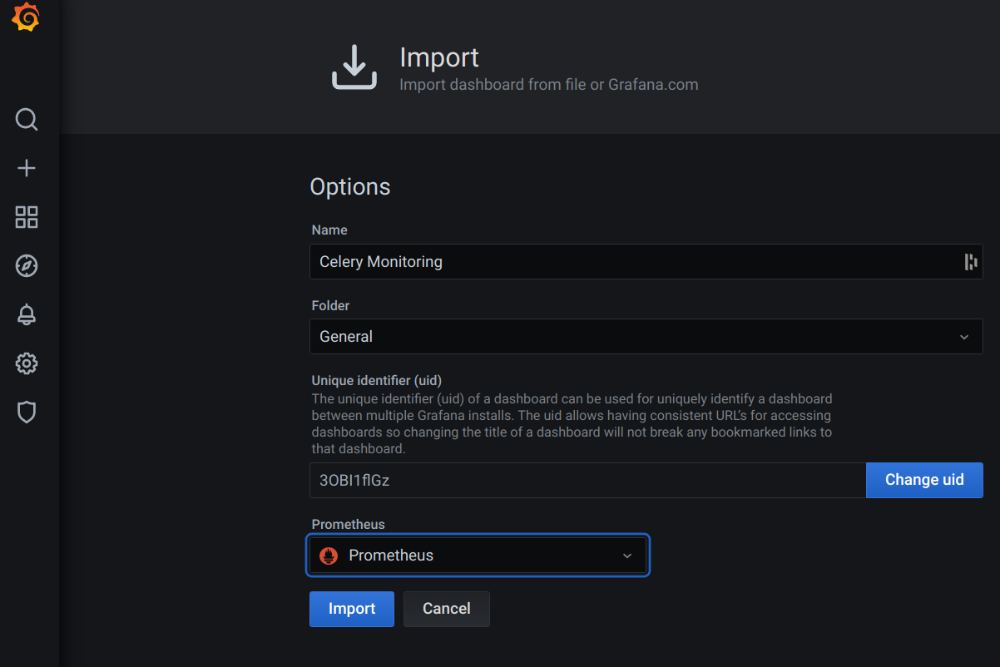

Prometheus Integration
======================

Flower exports several celery worker and task metrics in Prometheus' format.
The ``/metrics`` endpoint is available from the get go after you have installed Flower.

By default on your local machine Flower's metrics are available at: ``localhost:5555/metrics``.

Read further for more information about configuration and available metrics please.

Complete guide on integration of Celery, Flower, Prometheus and Grafana is here: `Celery -> Flower -> Prometheus -> Grafana Integration Guide`_.

Configure Prometheus to scrape Flower metrics
---------------------------------------------

To integrate with Prometheus you have to add Flower as the target in Prometheus's configuration.
In this example we are assuming your Flower and Prometheus are installed on your local machine
with their defaults and available at ``localhost:<port number>``.

To add Flower's metrics to Prometheus go to its config file ``prometheus.yml`` which initially
will look like this:

.. code-block:: yaml

    global:
      scrape_interval:     15s
      evaluation_interval: 15s

    scrape_configs:
      - job_name: prometheus
        static_configs:
          - targets: ['localhost:9090']

and alter the ``scrape_configs`` definition to be:

.. code-block:: yaml

    scrape_configs:
      - job_name: prometheus
        static_configs:
          - targets: ['localhost:9090']
      - job_name: flower
        static_configs:
          - targets: ['localhost:5555']

You can also just point Prometheus at the example ``prometheus.yml`` file in the root of the `Flower repository <https://github.com/mher/flower/prometheus.yml>`
when you start it from the command line (note that you would have to set ``flower`` to point at ``localhost`` in your ``etc/hosts`` config for the DNS to resolve correctly)::

    ./prometheus --config.file=prometheus.yml

Available Metrics
-----------------

Below you will find a table of available Prometheus metrics exposed by Flower.

+---------------------------------------------------+----------------------------------------------------------------------+--------------------+-----------------+
| Name                                              | Description                                                          |  Labels            | Instrument Type |
+===================================================+======================================================================+====================+=================+
| flower_events_total                               | Number of times a celery task event was registered by Flower.        | task, type, worker | counter         |
+---------------------------------------------------+----------------------------------------------------------------------+--------------------+-----------------+
| flower_task_prefetch_time_seconds                 | The time the task spent waiting at the celery worker to be executed. | task, worker       | gauge           |
+---------------------------------------------------+----------------------------------------------------------------------+--------------------+-----------------+
| flower_worker_prefetched_tasks                    | Number of tasks of given type prefetched at a worker.                | task, worker       | gauge           |
+---------------------------------------------------+----------------------------------------------------------------------+--------------------+-----------------+
| flower_task_runtime_seconds                       | The time it took to run the task.                                    | task, worker       | histogram       |
+---------------------------------------------------+----------------------------------------------------------------------+--------------------+-----------------+
| flower_worker_online                              | Shows celery worker's online status.                                 | worker             | gauge           |
+---------------------------------------------------+----------------------------------------------------------------------+--------------------+-----------------+
| flower_worker_number_of_currently_executing_tasks | Number of tasks currently executing at this worker.                  | worker             | gauge           |
+---------------------------------------------------+----------------------------------------------------------------------+--------------------+-----------------+

Using Metric Labels
-------------------

You can filter received data in prometheus using ``promql`` syntax to present information only for selected labels.
We have the following labels available:

* **task** - task name, i.e. ``tasks.add``, ``tasks.multiply``.
* **type** - task event type, i.e. ``task-started``, ``task-succeeded``. Note that worker related events **will not be counted**.
  For more info on task event types see: `task events in celery <https://docs.celeryq.dev/en/stable/userguide/monitoring.html#task-events>`_.
* **worker** - celery worker name, i.e ``celery@<your computer name>``.

Example Prometheus Alerts
-------------------------

See example `Prometheus alerts <https://github.com/mher/flower/tree/master/examples/prometheus-alerts.yaml>`_.
Add the rules to your ``alertmanager.yml`` config as in the `alert manager's documentation <https://prometheus.io/docs/alerting/latest/configuration/>`_.

Example Grafana Dashboard
-------------------------

See example `Grafana dashboard <https://github.com/mher/flower/tree/master/examples/celery-monitoring-grafana-dashboard.json>`_.
You can import it easily in Grafana.
Hover over the + button in the side bar menu -> Import -> Upload JSON file.
The dashboard should give you a nice starting point for monitoring of your celery cluster.

Celery -> Flower -> Prometheus -> Grafana Integration Guide
===========================================================

In this guide you will learn how to setup each part of the stack to make it talk to the next one and achieve Celery
monitoring solution with help of Flower.

Same as above we assume localhost usage and for ease of deployment I will use Pycharm configurations to start docker
containers with necessary images. If you do not have docker installed on your system: `download and install it please <https://www.docker.com/get-started>`_.

Start Celery Broker
-------------------

Easiest is to use `Redis Pycharm run configuration <https://github.com/mher/flower/tree/master/examples/pycharm-configurations/Redis.run.xml>`_.

Or run::

    docker run --name redis -d -p 6379:6379 redis

Set Up Your Celery Application
-------------------------------

We are assuming that your Celery application has tasks in `tasks.py` file. The `-E` argument makes Celery send events
which are required to produce Prometheus metrics.

Create `celeryconfig.py` in root of your Celery app. We are setting Celery to use Redis DB as the broker/backend in this
example. Skip this if you configure your broker/backend already in another way (make sure to adjust further steps to that).

.. code-block:: python

    broker_url = 'redis://localhost:6379/0'
    celery_result_backend = 'redis://localhost:6379/0'

Or download it from `here <https://github.com/mher/flower/tree/master/examples/celeryconfig.py>`_.

Start your Celery app::

    celery -A tasks worker -l INFO -E

When the app starts you should see this line::

    -- ******* ---- .> task events: ON

Start Flower Monitoring
-----------------------

In your Celery application folder run this command (Flower needs to be installed)::

    celery -A tasks --broker=redis://localhost:6379/0 flower

Configure and Start Prometheus
------------------------------

Create `prometheus.yml` file. Note its absolute path - we will use it to start the Prometheus docker image.
For ease of use put it in the root of your Celery project (so that you can use Pycharm configuration below without any changes).

.. code-block:: yaml

    global:
      scrape_interval:     15s
      evaluation_interval: 15s

    scrape_configs:
      - job_name: prometheus
        static_configs:
          - targets: ['localhost:9090']
      - job_name: flower
        static_configs:
          - targets: ['localhost:5555']

Run Prometheus inside docker:

You can use `Prometheus Pycharm run configuration <https://github.com/mher/flower/tree/master/examples/pycharm-configurations/Prometheus.run.xml>`_ (may need to adjust the `prometheus.yml` path if it is not in root of your Celery project).

Or just start it via command line::

    docker run --name Prometheus -v <ABSOLUTE PATH TO YOUR prometheus.yml FILE>:/etc/prometheus/prometheus.yml -p 9090:9090 --network host prom/prometheus

Now go to `localhost:9090` and check that Prometheus is running.
If everything so far was set up and started correctly, you should be able to see metrics provided by Flower in your
Prometheus's GUI. Go to `Graph` tab and start typing `flower` - the autocomplete should show you all available metrics.

Start Grafana
-------------

You can use `Grafana Pycharm run configuration <https://github.com/mher/flower/tree/master/examples/pycharm-configurations/Grafna.run.xml>`_.

Or run it from the terminal::

    docker run --name Grafana -d -v grafana-storage:/var/lib/grafana -p 3000:3000 --network host grafana/grafana

try to access its web GUI now by going to `localhost:3000`, use `admin/admin` for credentials. It will ask you to set up
a new password - you may click skip for now.

Add Prometheus As a Data Source In Grafana
------------------------------------------

Click `Configuration` (settings icon) in the left side-bar. Then the blue `Add data source` button.

Search for Prometheus data source and click it (it should be at the top).

.. image:: screenshots/grafana-add-prometheus-data-source.png
   :width: 100%

Once in Prometheus data source configuration, use all defaults and enter the HTTP/URL parameter as below (which is the placeholder by the way)::

    http://localhost:9090

Scroll down and click `Save & Test`, if all is good a green banner will pop up saying `Data source is working`

Import The Celery Monitoring Dashboard In Grafana
-------------------------------------------------

Download `Grafana dashboard <https://github.com/mher/flower/tree/master/examples/celery-monitoring-grafana-dashboard.json>`_.

Hover over the `+` icon in the left side-bar and click `Import` button.

Click `Upload JSON file` button and select the `celery-monitoring-grafana-dashboard.json` you have just downloaded.

Click on the `Prometheus` field and select a Prometheus data source.

Click `Import` to finish the process.

You should see a dashboard as on the image below. Congratulations!

.. image:: screenshots/grafana-dashboard.png
   :width: 100%
