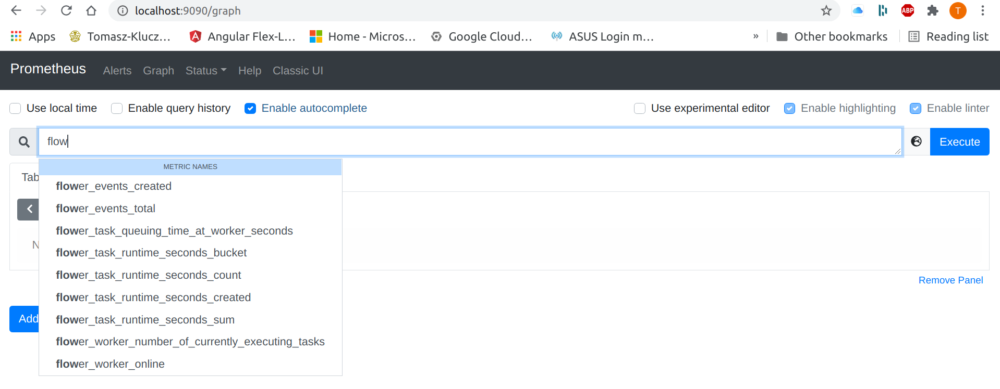
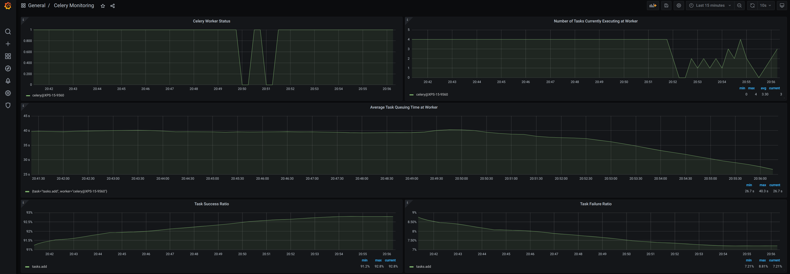
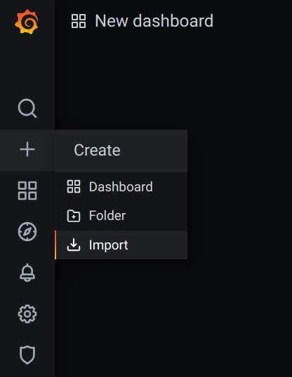
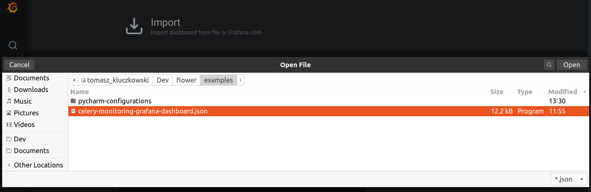
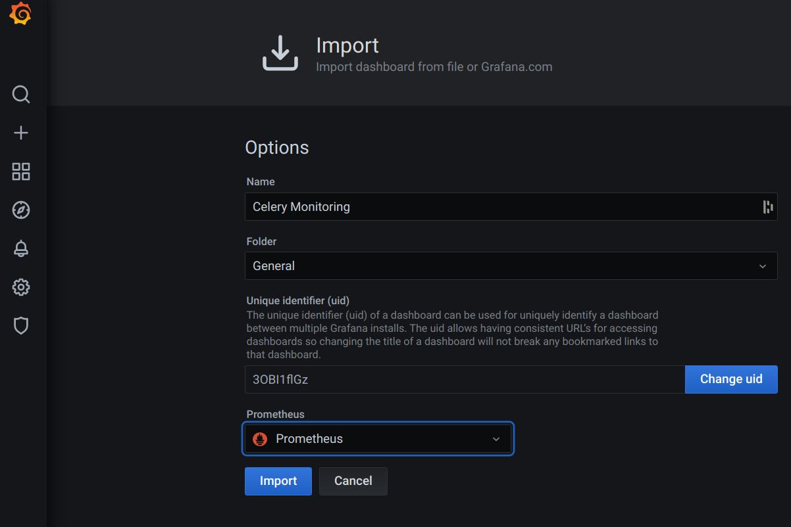

Prometheus Integration
======================

Flower exports several celery worker and task metrics in Prometheus format.
The ``/metrics`` endpoint is available as soon as Flower is running.

By default on your local machine Flower's metrics are available at: ``localhost:5555/metrics``.

Read on for configuration details and the list of available metrics.

For a complete walkthrough of Celery, Flower, Prometheus and Grafana, see the `Grafana Integration Guide`_.

Configure Prometheus to scrape Flower metrics
---------------------------------------------

To integrate with Prometheus you have to add Flower as a target in the Prometheus configuration.
In this example we are assuming your Flower and Prometheus are installed on your local machine
with their defaults and available at ``localhost:<port number>``.

To add Flower's metrics to Prometheus open its config file ``prometheus.yml``, which initially
looks like this:

.. code-block:: yaml

    global:
      scrape_interval:     15s
      evaluation_interval: 15s

    scrape_configs:
      - job_name: prometheus
        static_configs:
          - targets: ['localhost:9090']

and alter the ``scrape_configs`` definition to be:

.. code-block:: yaml

    scrape_configs:
      - job_name: prometheus
        static_configs:
          - targets: ['localhost:9090']
      - job_name: flower
        static_configs:
          - targets: ['localhost:5555']

You can also just point Prometheus at the example ``prometheus.yml`` file in the root of the `Flower repository <https://github.com/mher/flower/blob/master/prometheus.yml>`_
when you start it from the command line (note that ``flower`` must resolve to ``localhost``, for example through ``/etc/hosts``)::

    ./prometheus --config.file=prometheus.yml

Available Metrics
-----------------

The table below lists the Prometheus metrics exposed by Flower.

+---------------------------------------------------+----------------------------------------------------------------------+--------------------+-----------------+
| Name                                              | Description                                                          |  Labels            | Instrument Type |
+===================================================+======================================================================+====================+=================+
| flower_events_total                               | Number of times a celery task event was registered by Flower.        | task, type, worker | counter         |
+---------------------------------------------------+----------------------------------------------------------------------+--------------------+-----------------+
| flower_task_prefetch_time_seconds                 | The time the task spent waiting at the celery worker to be executed. | task, worker       | gauge           |
+---------------------------------------------------+----------------------------------------------------------------------+--------------------+-----------------+
| flower_worker_prefetched_tasks                    | Number of tasks of given type prefetched at a worker.                | task, worker       | gauge           |
+---------------------------------------------------+----------------------------------------------------------------------+--------------------+-----------------+
| flower_task_runtime_seconds                       | The time it took to run the task.                                    | task, worker       | histogram       |
+---------------------------------------------------+----------------------------------------------------------------------+--------------------+-----------------+
| flower_worker_online                              | Shows celery worker's online status.                                 | worker             | gauge           |
+---------------------------------------------------+----------------------------------------------------------------------+--------------------+-----------------+
| flower_worker_number_of_currently_executing_tasks | Number of tasks currently executing at this worker.                  | worker             | gauge           |
+---------------------------------------------------+----------------------------------------------------------------------+--------------------+-----------------+

Using Metric Labels
-------------------

You can filter the data in Prometheus using PromQL to show only selected labels.
The following labels are available:

* **task** - task name, e.g. ``tasks.add``, ``tasks.multiply``.
* **type** - task event type, e.g. ``task-started``, ``task-succeeded``. Note that worker related events **will not be counted**.
  For more info on task event types see: `task events in celery <https://docs.celeryq.dev/en/stable/userguide/monitoring.html#task-events>`_.
* **worker** - celery worker name, e.g. ``celery@<your computer name>``.

Example Prometheus Alerts
-------------------------

See the example `Prometheus alerts <https://github.com/mher/flower/tree/master/examples/prometheus-alerts.yaml>`_.
Add the rules to your ``alertmanager.yml`` config as in the `alert manager's documentation <https://prometheus.io/docs/alerting/latest/configuration/>`_.

Example Grafana Dashboard
-------------------------

See the example `Grafana dashboard <https://github.com/mher/flower/tree/master/examples/celery-monitoring-grafana-dashboard.json>`_.
The `Grafana Integration Guide`_ below shows how to import it.
The dashboard is a good starting point for monitoring your Celery cluster.

Grafana Integration Guide
=========================

The quickest way to see the whole stack working is the `docker-compose.yml`_ file in the root of
the Flower repository. It starts Redis, a Celery worker, Flower, Prometheus and Grafana.
Prometheus is configured to scrape Flower, and Grafana is provisioned with the Prometheus data
source and the Celery monitoring dashboard, so nothing has to be set up by hand.

.. _docker-compose.yml: https://github.com/mher/flower/blob/master/docker-compose.yml

Start the stack
---------------

From a checkout of the repository run::

    docker compose up --build

Once the containers are up, the services are available at:

- Flower at http://localhost:5555
- Prometheus at http://localhost:9090
- Grafana at http://localhost:3000

Submit a few tasks so there is something to look at::

    curl -X POST -d '{"args":[1,2]}' http://localhost:5555/api/task/async-apply/tasks.add

Check Prometheus
----------------

Open http://localhost:9090, go to the `Graph` tab and start typing `flower`. The autocomplete
lists all metrics exported by Flower.

Open the dashboard in Grafana
-----------------------------

Open http://localhost:3000. Anonymous access is enabled and the Celery monitoring dashboard is
the home page, so no login is needed.

Import the dashboard into an existing Grafana
---------------------------------------------

If you already run Prometheus and Grafana, add Flower as a scrape target as described in
`Configure Prometheus to scrape Flower metrics`_ and add Prometheus as a data source in Grafana
following the `Grafana data source documentation`_. Then import the dashboard.

Download the `Grafana dashboard`_ JSON file.

Hover over the `+` icon in the left side-bar and click `Import`.

Click `Upload JSON file` and select the `celery-monitoring-grafana-dashboard.json` file.

Select your Prometheus data source in the `Prometheus` field and click `Import`.

.. _Grafana dashboard: https://github.com/mher/flower/blob/master/examples/celery-monitoring-grafana-dashboard.json
.. _Grafana data source documentation: https://grafana.com/docs/grafana/latest/datasources/prometheus/configure/
